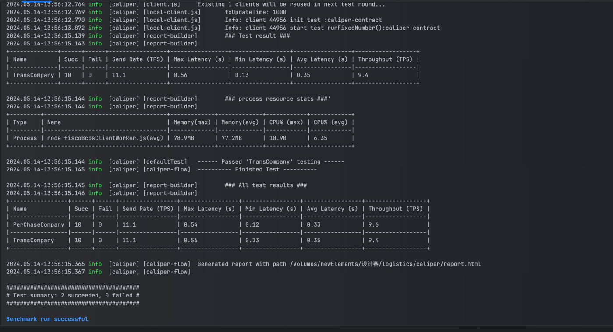
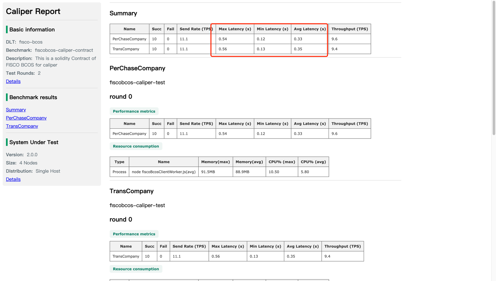
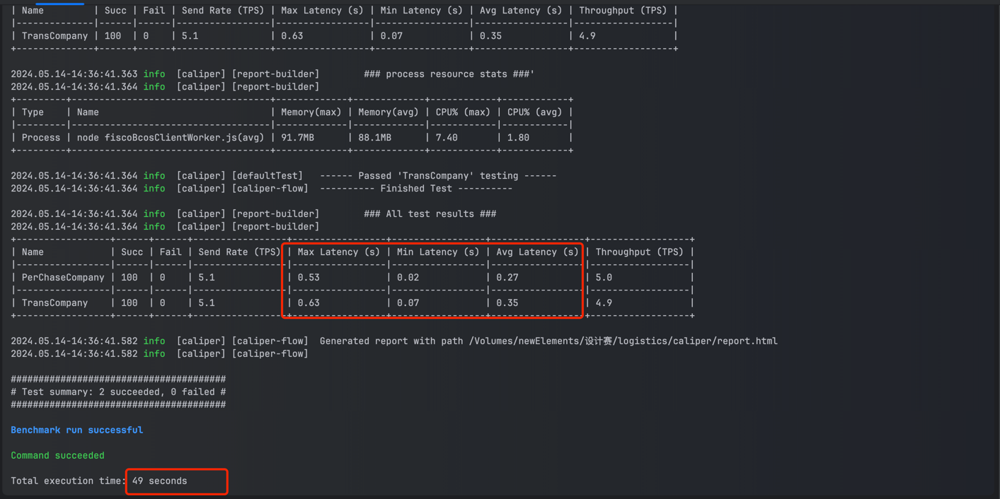

### 目录结构
```
- caliper
  - contract
    - ordinary 未加入并行方法的普通合约
    - parallel 加入了并行方法的合约
  - config.yaml 测试配置文件
  - fisco-bcos.json 网络配置文件
  - PerChaseCompany.js 采购公司相关测试
  - TransCompany.js 物流公司相关测试
  - report.html 测试报告
  - start.sh 启动脚本
```
### 进行压力测试
1.未加入并行方法的合约测试

运行start.sh脚本


[测试报告](./static/report_ordinary.html)


从测试报告中我们可以看出 PerChaseCompany 中 api 平均延迟为 0.33 秒，最大延迟达到了0.54秒，最低延迟0.12秒，TransCompany我们也可以很直观的看出

2.使用并行方法的合约测试

我们可以看到执行100次，执行完成耗时49s